# RTZulip или ReturnToZulip (вдохн. [RTZ](https://en.wikipedia.org/wiki/Return-to-zero))
RTZulip - альтернативный клиент для [Zulip](https://zulip.com/) - ПО для совместной работы (чат), преимущественно используемое внутри организаций.

Позволяет быстро и безболезненно вести коммуникацию внутри организации благодаря множеству возможностей платформы Zulip, где сообщения организованы как на форумах: разделяются по каналам, которые подразделяются на темы для общения (топики).  
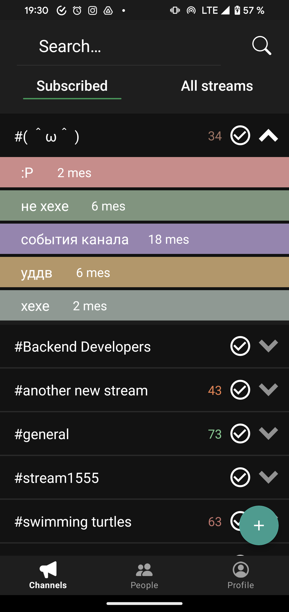
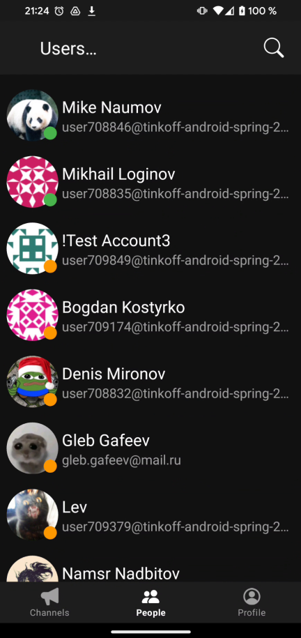
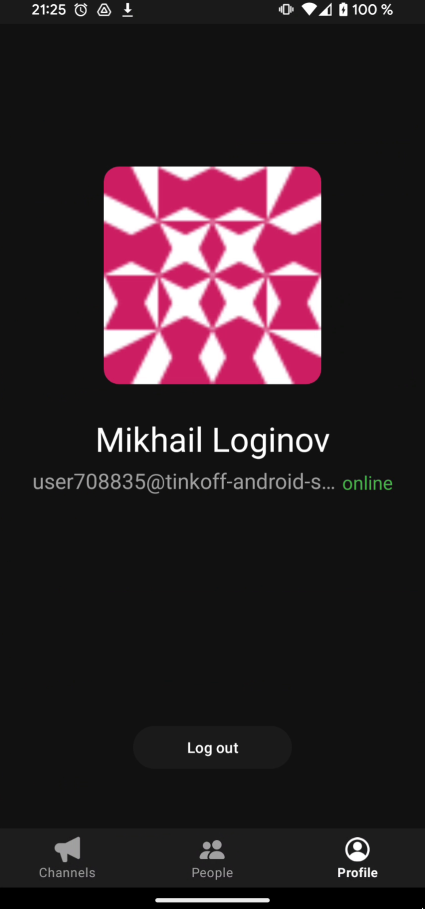
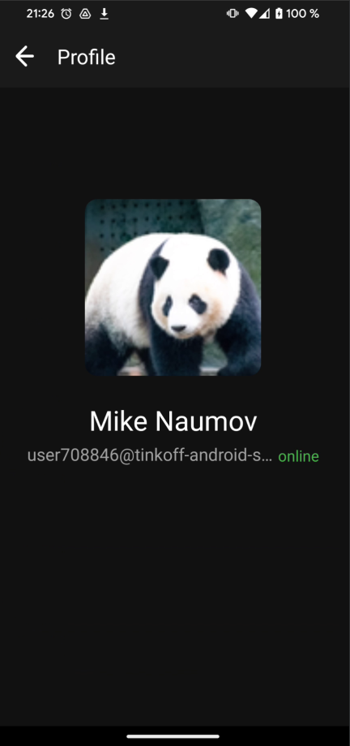
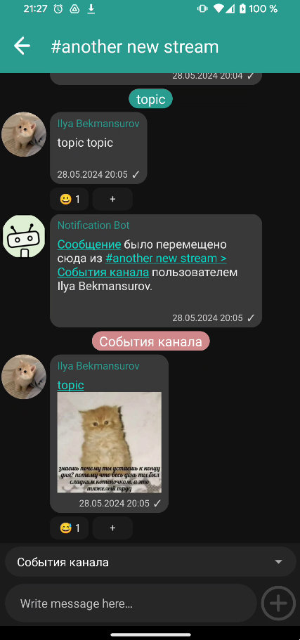
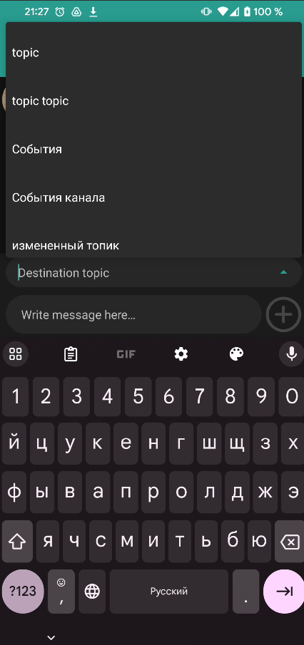
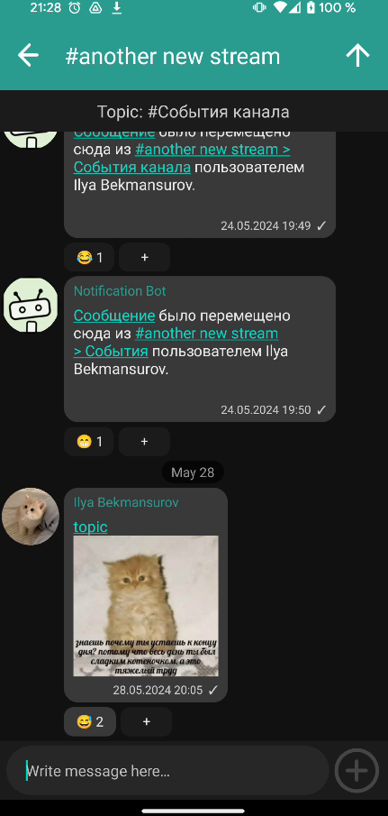
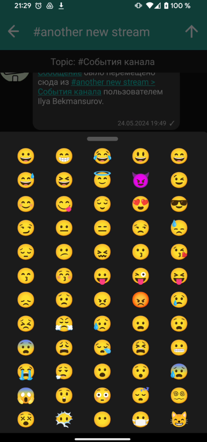
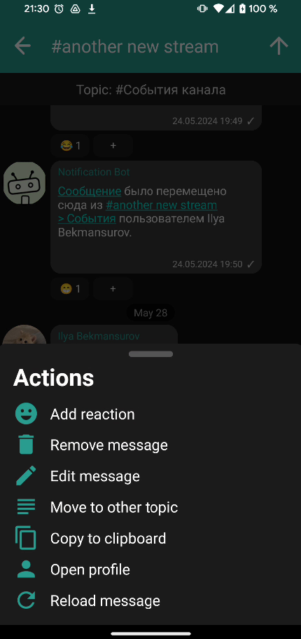
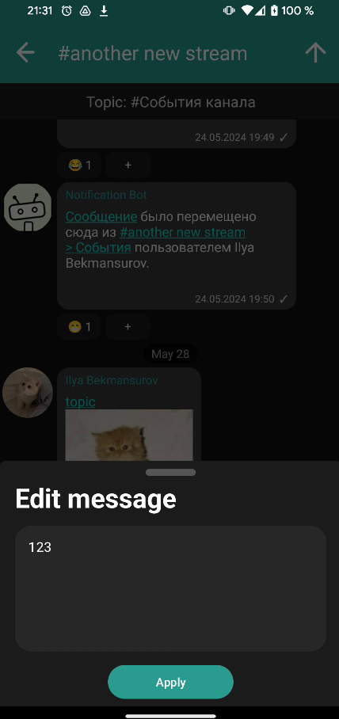
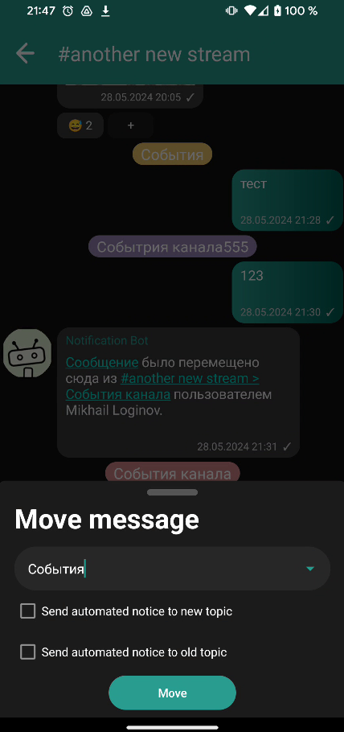
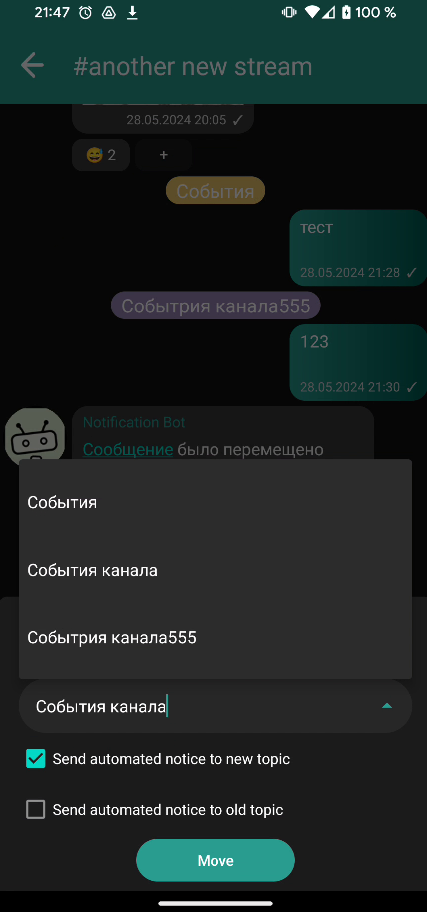
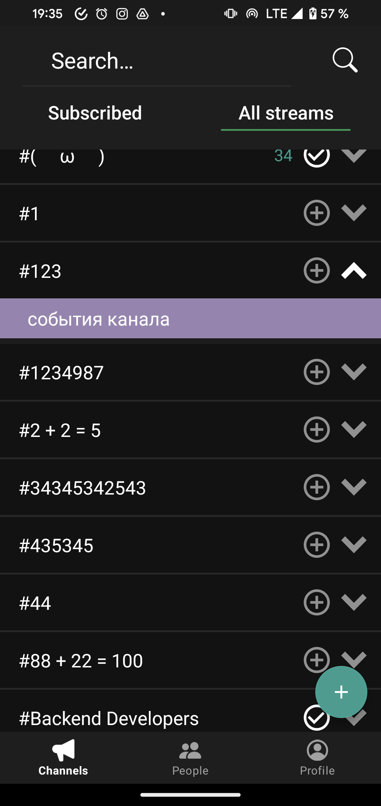
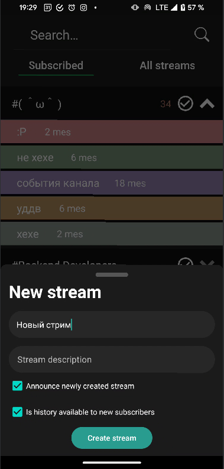
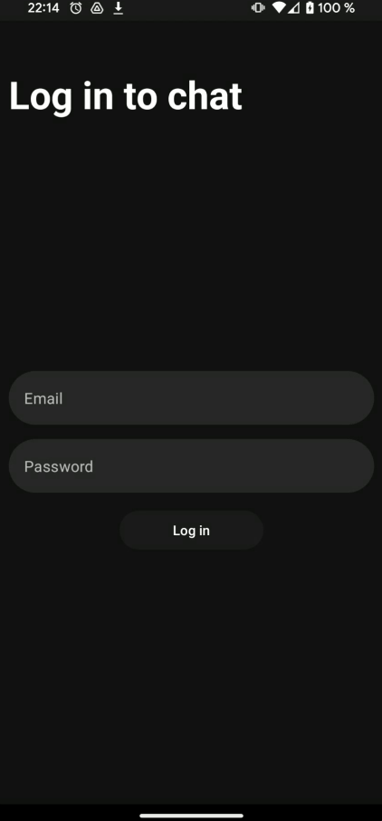
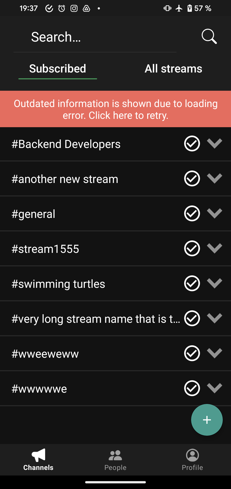
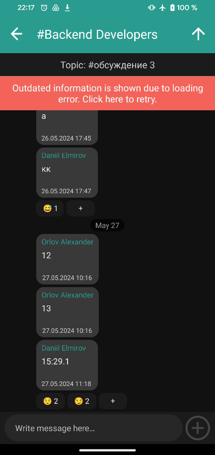
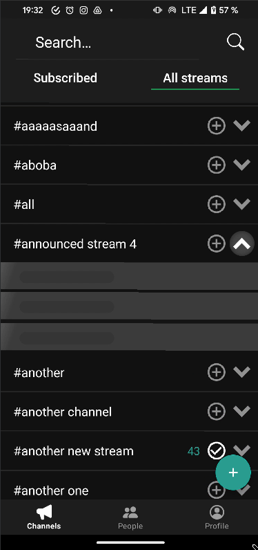
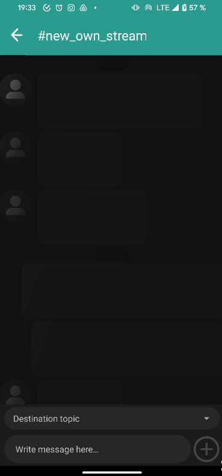
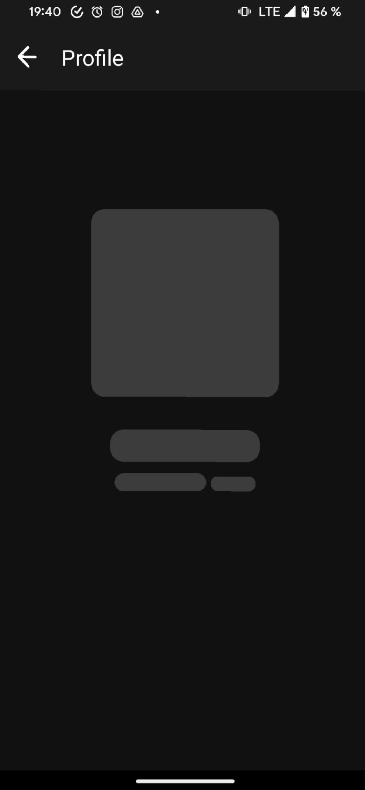
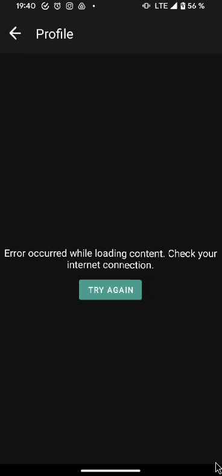

# Демонстрация

# Фичи проекта
- Возможность авторизации и выхода из аккаунта
- Полная реактивность приложения (см. раздел "Реактивность приложения"), которая всегда обеспечивает актуальность отображаемых данных благодаря long-polling - у
- Режим нескольких топиков на экране чата: можно в любой момент перейти из режима показа одного топика к показу всех топиков (нажав стрелку вверх в правом верхнем углу экрана), а при отображении всех топиков можно кликнуть на прямо топик в списке сообщений и перейти к общению в конкретном топике. Все это - без перехода между экранами благодаря корректному менеджменту MVU-стейта
- Возможность отправки сообщения в разные топики в режиме отправи сообщений в несколько топиков. При выборе топика есть подсказки (используется AutoCompleteTextView)
- Возможность отравки вложений (фотографий или других файлов)
- Возможность показа вложений (например, фотографий) или markdown/html разметки внутри сообщений благодаря библиотеке Markwon
- При первом получении данных всегда показываются шиммеры на всех экранах
- Подход cache-first при работе с данными для всех экранов: если пользователь останется без интернета или ждет загрузки, ему будут показаны закешированные данные
- Правильная работа с жизненным циклом: очередь событий не отслеживается в фоне, благодаря чему система долго не убивает приложение
- Обработка устаревания сессии: если API ключ устареет, то пользователя выбросит из сессии
- Показ количества непрочитанных сообщений на экране каналов (как для топиков, так и для стримов)
- Возможность подписки и отписки от каналов (статус подписки отображается слева от кнопки раскрытия топиков: плюс или галочка)
- Возможность создавать свои каналы, в т.ч. задавать различные параметры (описание, оповещение о новом канале, отображение истории для новых подписчиков)
- Возможность перемещать сообещния между каналами (при задании канала имеются подсказки: используется AutoCompleteTextView)
- Возможность редактировать, удалять, копировать сообщения
- Возможность перейти к профилю пользователя из чата
- Возможность добавлять (выбрав уже существующую реакцию или реакцию из списка), удалять реакции
- Реакции никогда мигают благодаря использованию AsyncListDiffer для контейнера с реакциями (для реакций поддерживаются Payload + асихнронный дифф, а в контейнере с реакциями реализованы коллбеки для AsyncListDIffer-а)
- Для всех элементах в ресайклере, где это необходимо, используются Payload (то есть, почти везде)
- CustomView для сообщений, реакций, контейнера с реакциями
- При просмотре сообщений они помечаются как прочитанные. При изменении статуса о том, прочтено сообщение или нет (будь то с этого устройства или другого компьютера, в чате сразу меняется отметка - галочка в правом нижнем углу)
- Поддерживается переход по относительным ссылкам из сообщения для загрузки вложений и просмотра картинок
- Юнитами покрыта презентационная логика чата + маппер (суммарно более 100 юнит-тестов)
- Базовый функционал основных экранов (чат, каналы, люди, профиль) покрыт инстументальными или UI-тестами (Kaspresso+WireMock)

# Реактивность приложения 
Приложение полностью реактивно и показывает самые актуальные данные с сервера благодаря системе событий на long-polling-е , которые обрабатываются по приципу стейт-машины в Reducer-e (клиент просит сообщения - сервер их возвращает с задержкой, клиент обрабатывает и запрашивает новые сообщения). Была портирована функциональность из еще не вышедшей релизной версии Elmslie (3.0), в которой была добавлена возможность отмены команд (метод asSwitchingFlow), путем реализации compat-SwitchingActor-а. При сворачивании приложение перестает отслеживать очередь, благодаря чему система не убивает приложение. В случае, если пользователь вернулся в приложение раньше 10 минут (время жизни очереди, если ее не собирать), он наверстает все события и получит полностью обновленный экран, иначе экран будет перезагружен (это [рекомендованный подход в документации Zulip](https://zulip.com/api/get-events))

Следующие данные всегда обновляются при наличии подключения к серверу: 
- При добавлении новых каналов они сразу добавляются на экране с каналами
- При подписке на новый канал он сразу появляется в подписках
- При создании нового топика он сразу появляется в списке топиков 
- Если отметить сообщение непрочитанным/прочитанным с другого компьютера, то оно сразу меняет свое состояние в списке топиков (для каждого топика и стрима отображается кол-во непрочитанных сообщений)
- Если у пользователя меняется статус - он в автоматическом режиме меняется на экране со списком пользователей и на экране профиля текущего или чужого пользователя
- При приходе новых сообщений они сразу появляются в списке
- При добавлении/удалении реакций они сразу появляются на экране
- При изменении сообщения оно сразу обновится в чате
- При перемещении сообщения из топика/в топик оно появляется/пропадает соответственно
- При изменении отметки прочтено/не прочтено она появляется/пропадает в соответствующем сообщении чата

# Архитектура
Приложение многомодульное: экраны живут в своих фичах, а фичи распилены по чистой архитектуре: на data, domain_api, domain_impl, presentation. Благодаря разделению домейн-слоя на апи и реализацию, имеется возможность дергать разные юз-кейсы из презентационных слоев, обеспечивая слабую связанность и не ограничиваясь рамками одной фичи. 

DI между модулями обеспечивается путем написанного вручную решения для многомодульного инжекта: у каждого модуля есть свой ComponentHolder, для инициализации которого требуются предоставленные извне зависимости. ComponentHolder же, в свою очередь, имеет возможность предоставлять API для других модулей (так и построена слабая зависимость между presentation-domain-data слоями).

Вся логика для работы компонент холдера реализована в отдельном модуле module_injector. Компоненты инициализируются лениво, собираются garbage collector-ом, когда на них не хранится ссылка (ComponentHolder хранит WeekReference на компоненты). DI в самих модулях реализован с помощью Dagger2, но легко и плавно может быть осуществлен переезд на Manual DI (при этом часть фичей могут жить на даггере, часть - на manual DI)

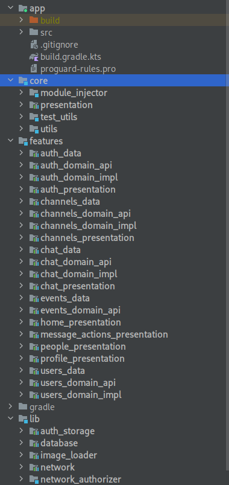

Архитектура презентационного слоя реализована с помощью TEA/ELM - библиотеки Elmslie. Благодаря MVU + UDF получилось полностью избавиться от неконсистентных стейтов и обеспечить отслеживание обновлений с сервера по принципу стейт-машины: сервер бесконечно присылает новые ивенты, клиент их обрабатывает и идет за новыми. В случае ошибки - или пробует снова (если ошибка связана с отсутствием сети), или получает данные снова и подписывается на обновления для обеспечивания консистентности. Также благодаря такой архитектуре легко получилось осуществить переход между различными режимами отображения сообщений: можно просматривать весь стрим целиком или только конкретный топик.

# Краткая сводка по используемым технологиям и подходам
## UI
* XML-экраны, сверстанные по дизайну в фигме
* RecylerView с самописным адаптером на типобезопасных делегатах (на дженериках)
* CustomView для сообщений (на базе лэйаута) и реакций (полностью самописная)
* Custom ViewGroup - FlexBoxLayout для контейнера реакций с большим количеством настроек
## Презентационный слой
* MVU архитектура - TEA/ELM с помощью библиотеки Elmslie
## Навигация
* Cicerone + Router-ы для независимой навигации между фичами
* Основана на фрагментах
## Dependency Injection
* Dagger2 для локального DI в фичах
* Manual DI для DI между фичами на базе ComponentHolder-ов с ленивой иницализацией и автоматическим сбором GC (хранится WeekReference на компонент)
## Асихнронное взаимодействие
* Реализовано с использованием KotlinX Coroutines + Flow
* Retrofit2 для взаимодействия с API
* Room для кэша и хранения данных об авторизации
## Тестирование
* UI-тесты с использованием Kaspresso
* Мок веб-сервера с помощью Wiremock
* Unit-тесты с использование Kotest 
## Многомодульность
* Фичи разделены на модули по клину + domain разделен на api/impl
* Есть lib-модули: там находятся бд, сеть и прочие вспомогательные модули
* Core-модули: модули, используемые несколькими фичами. Могут зависеть друг от друга.
